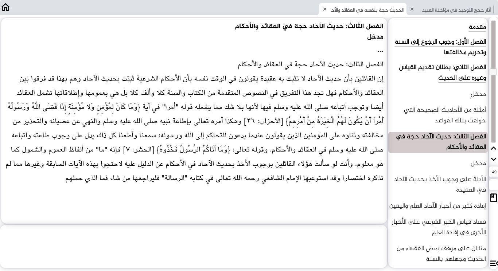
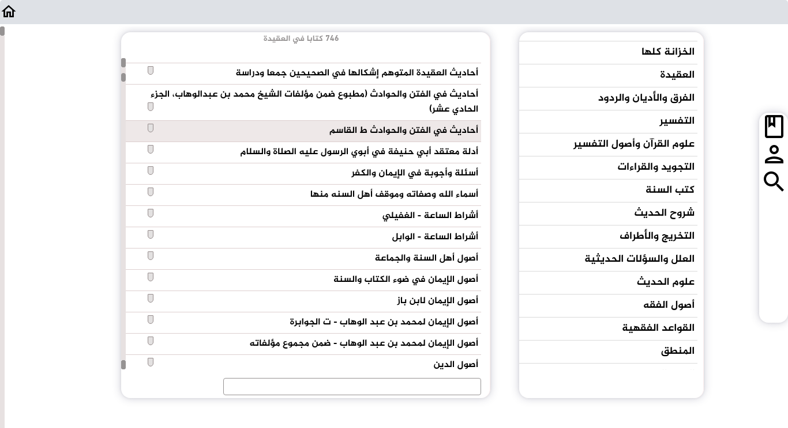
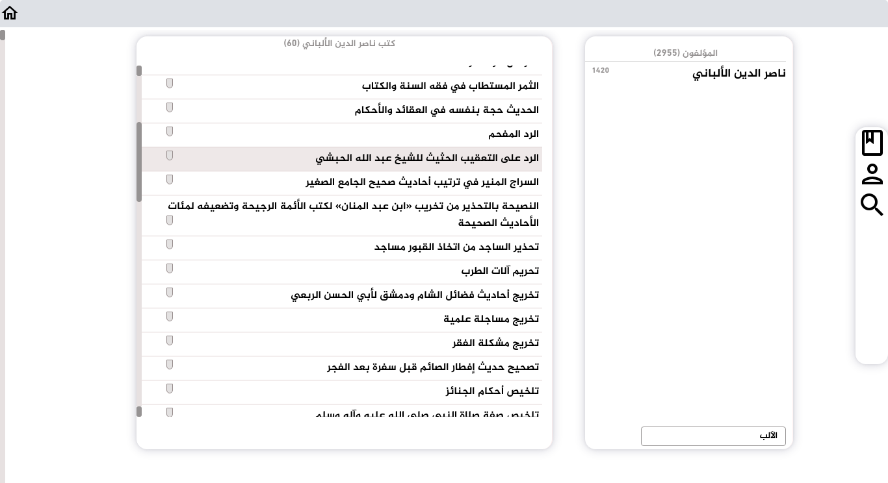
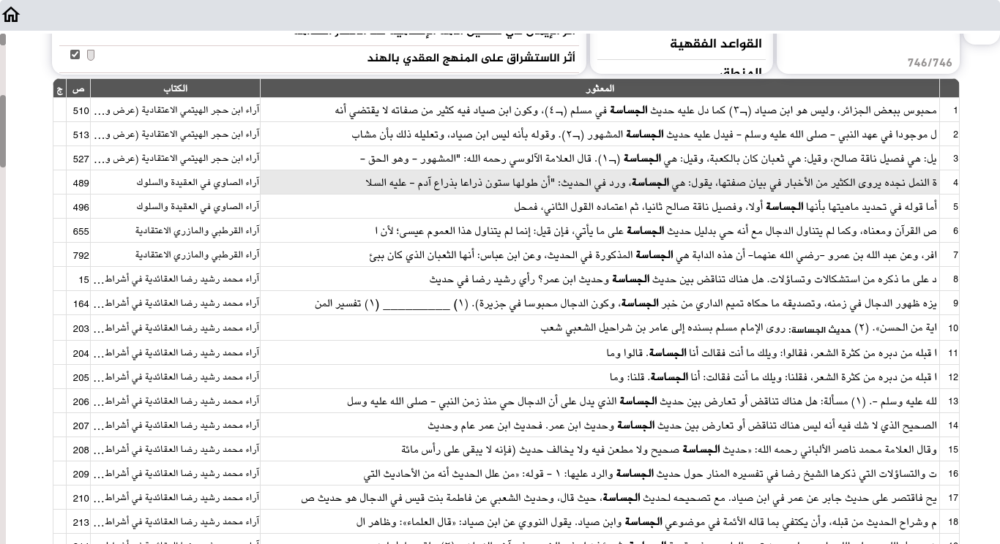

# kizana

الخزانة فيها ثمانية آلاف كتاب من الكتب الشرعية و غيرها يمكنك المطالعة و البحث فيها.  
الخزانة تشتغل في الأنظمة الثلاث : Linux و Windows و MAC. 
الخزانة مفتوحة المصدر (Open Source) ليس عليها حجر في الإستعمال أو النسخ أو التوزيع أو التغيير. 
الخزانة قاعدة بياناتها (كتبها كلها) مأخوذة من المكتبة الشاملة الشهيرة. 

<code> npm install  
npm start </code>

<h6 dir="rtl" >صور منها :</h6>
 
  
  
  